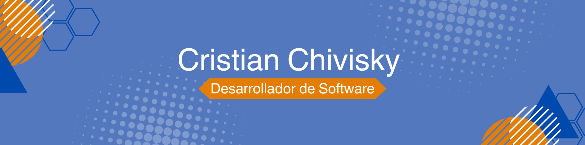

## 🌟 Sobre mí

Soy un apasionado desarrollador de software, con un gran interés en tecnología, programación y matemática. Soy Analista de Sistemas y actualmente estoy estudiando la Licenciatura en Sistemas de Información en la Facultad de Ciencia y Tecnología, UADER. Me encanta aprender nuevas tecnologías y contribuir a proyectos desafiantes.

## 📫 Cómo contactarme

- **Correo electrónico:** [cristianchivisky@gmail.com](mailto:cristianchivisky@gmail.com)
- **LinkedIn:** [www.linkedin.com/in/cristian-chivisky-3186aa242](https://www.linkedin.com/in/cristian-chivisky-3186aa242)
- **Portafolio:** Pronto estará disponible.

## 🚀 Lenguajes y herramientas

                        

## 🌱 Actualmente estoy aprendiendo

- Inteligencia Artificial.
- BBDD Avanzadas.
- Metodología de la investigación.
- Inglés.

¡Gracias por visitar mi perfil! Puedes contactarme si tienes alguna pregunta o simplemente quieres conocer más sobre mí.
¡Saludos!

