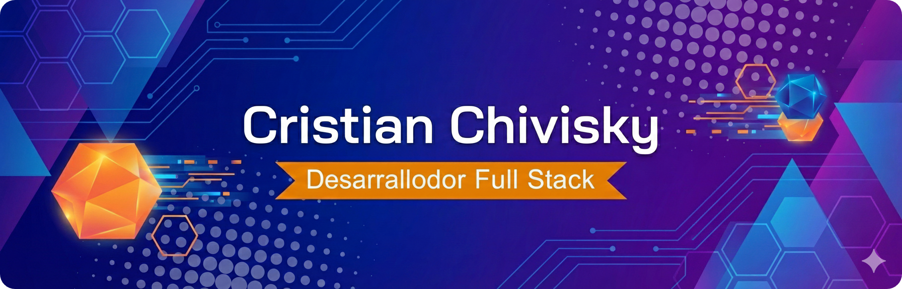
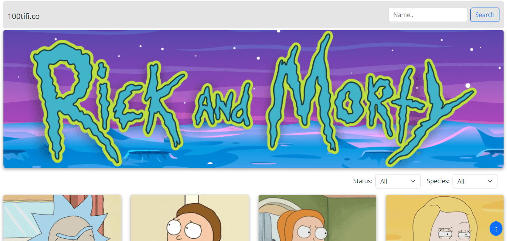
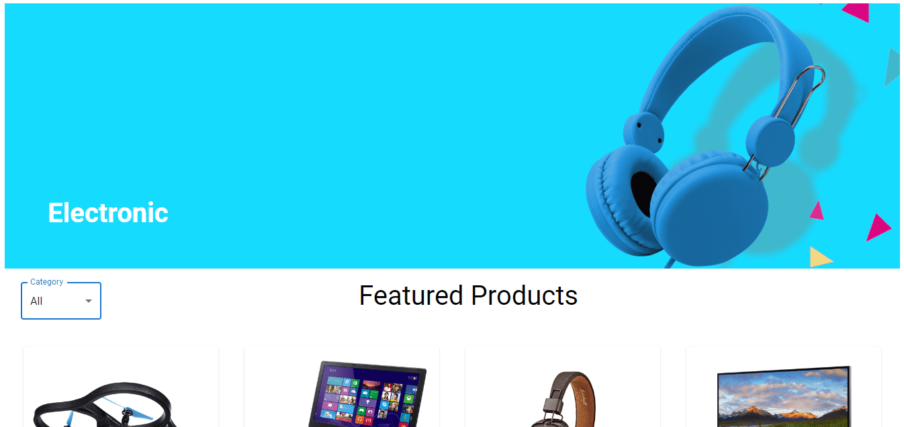
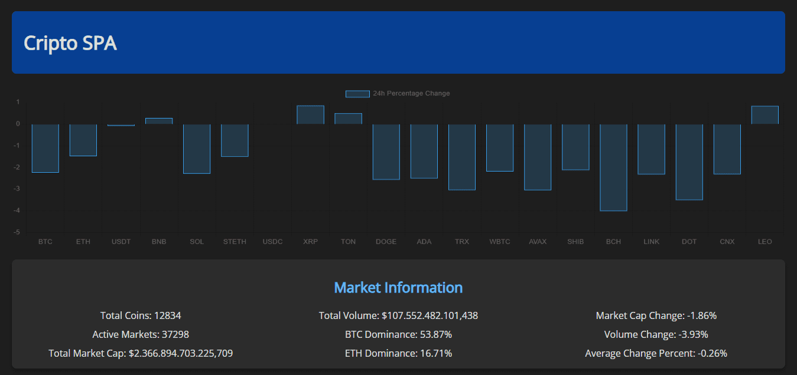

# ¡Hola, soy Cristian Chivisky! 👋

## 🌟 Sobre mí

Soy un apasionado desarrollador full stack, con un gran interés en la tecnología, la programación y la matemática. Actualmente soy Analista de Sistemas y estoy cursando la Licenciatura en Sistemas de Información en la Facultad de Ciencia y Tecnología, UADER. Me encanta aprender nuevas tecnologías y contribuir a proyectos desafiantes.

## 🔗 Redes Sociales

- **Correo electrónico:** [cristian.chivisky@gmail.com](mailto:cristian.chivisky@gmail.com)
- **LinkedIn:** [www.linkedin.com/in/cristian-chivisky-3186aa242](https://www.linkedin.com/in/cristian-chivisky-3186aa242)
- **Portafolio:** [https://cristian-chivisky.vercel.app/](https://cristian-chivisky.vercel.app/)

## 🚀 Habilidades

### Características blandas:

- **Trabajo en equipo:** Tengo la capacidad de colaborar de manera efectiva con otros para alcanzar objetivos comunes.
- **Comunicación efectiva:** Me expreso con claridad y precisión, para transmitir ideas y resolver problemas.
- **Proactividad:** Tengo iniciativa para identificar y resolver problemas, siempre intentando avanzar y mejorar.
- **Perseverancia:** Soy persistente y constante en mis esfuerzos.
- **Confiabilidad:** Soy una persona confiable y estable, que cumple con sus compromisos.

### Lenguajes de programación:

### Frameworks y tecnologías:

### Bases de datos:

### Otras herramientas:

## 📂 Proyectos Destacados

| | Rick and Morty SPA | Aerolab | Información de Criptomonedas |
|---|-------------------|---------|-----------------------------|
| **Imagen** |  |  |  |
| **Descripción** | Aplicación web que muestra información sobre personajes de la serie Rick and Morty. Permite buscar, filtrar personajes y mostrar detalles del personaje seleccionado. **Tecnologías:** JavaScript, Bootstrap, Webpack | Plataforma que utiliza la API de Aerolab para visualización de productos. También ofrece filtrado por categoría y detalles de cada producto. **Tecnologías:** Vite, React, Material UI | SPA que muestra información sobre criptomonedas utilizando la API de Coinlore. Ofrece listado, búsqueda por nombre y detalles de cada una. **Tecnologías:** Webpack, Coinlore API |
| **Enlaces** | [Repositorio](https://github.com/cristianchivisky/Cientifico-SPA.git) \| [Demo](https://66afddb23cf2b4f33bb520db--resonant-centaur-46cbaf.netlify.app/) | [Repositorio](https://github.com/cristianchivisky/Aerolab-Challenge-PA.git) \| [Demo](https://animated-kringle-c4c6b2.netlify.app/) | [Repositorio](https://github.com/cristianchivisky/SPA-Coinlore.git) \| [Demo](https://66b03fad0175d3542c536643--curious-zuccutto-070623.netlify.app/) |

## 🌱 Actualmente estoy aprendiendo

- Inteligencia Artificial: A través de la facultad (4to año) y proyectos en Python y Prolog.
- Bases de Datos Avanzadas: Incluyendo SQL avanzado, bases de datos temporales y bases de datos orientadas a objetos.
- Metodología de la Investigación: Enfocado en un proyecto sobre cómo la IA puede mejorar la mala alimentación de las personas.
- Inglés: Practicando mediante una aplicación.

## 📞 ¡Contactame!

Si tienes alguna pregunta o simplemente quieres conocer más sobre mí, no dudes en contactarme. Estoy siempre abierto a nuevas oportunidades y colaboraciones.

¡Gracias por visitar mi perfil! ¡Saludos!

