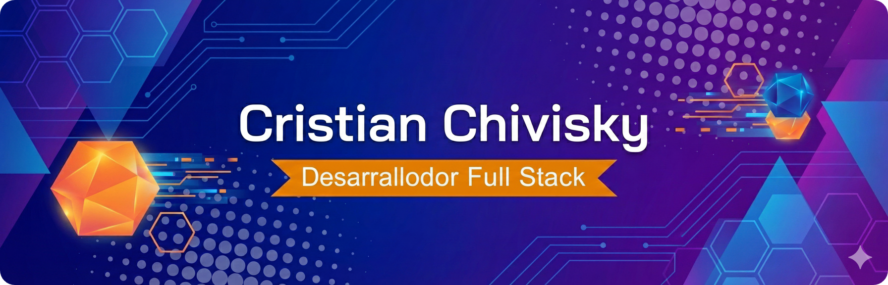
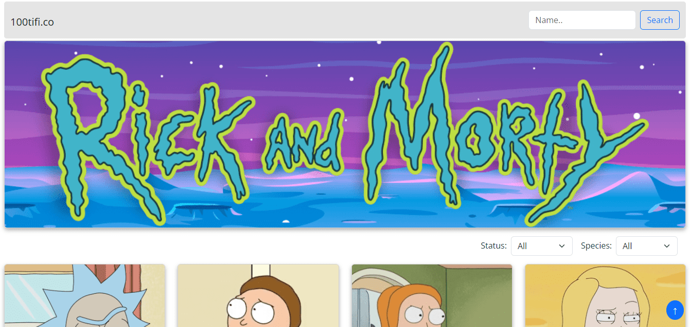
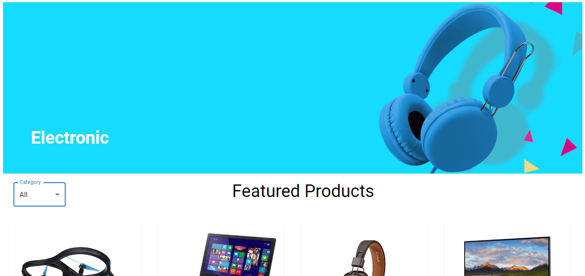
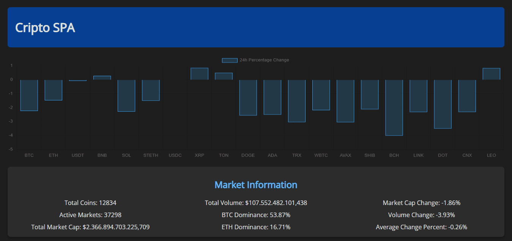

# ¡Bienvenido a mi perfil! 👋

## 🌟 Sobre mí

Soy desarrollador **Full Stack** con enfoque en la construcción de aplicaciones web modernas, escalables y con buenas prácticas.  
Tengo una sólida base académica: finalicé el cursado del 5to año de la **Licenciatura en Sistemas de Información** (FCyT – UADER) y solo me resta el Proyecto Final de Carrera.

Me apasiona crear soluciones reales, aprender nuevas tecnologías y trabajar en proyectos desafiantes que me permitan crecer como profesional.

---

## 🚀 Principales Habilidades  (Hard & Soft Skills)

### 🧠 Habilidades Blandas

- **Adaptabilidad**: Me ajusto rápidamente a nuevos entornos, herramientas y metodologías. 
- **Confiabilidad:** Soy una persona confiable y estable, que cumple con sus compromisos. 
- **Proactividad:** Tengo iniciativa para identificar y resolver problemas, siempre intentando avanzar y mejorar.
- **Perseverancia:** Soy persistente y constante en mis esfuerzos.
- **Trabajo en equipo:** Tengo la capacidad de colaborar de manera efectiva con otros para alcanzar objetivos comunes.

### 🖥️ Lenguajes de programación

### 🎨 Frontend

### ⚙️ Backend

### 🗄️ Bases de datos

### 🛠️ Otras herramientas

### 🏗️ Arquitecturas / Conceptos

**REST APIs** - **Arquitectura MVC** - **SPA** - **Microservicios** - **Metodologías ágiles**

---

## 📊 Estadísticas

 

---

## 📂 Algunos Proyectos Académicos

| Rick and Morty SPA | Aerolab | Información de Criptomonedas |
|-------------------|---------|-----------------------------|
|  |  |  |
| Aplicación web que muestra información sobre personajes de la serie Rick and Morty. Permite buscar, filtrar personajes y mostrar detalles del personaje seleccionado. | Plataforma que utiliza la API de Aerolab para visualización de productos. También ofrece filtrado por categoría y detalles de cada producto. | SPA que muestra información sobre criptomonedas utilizando la API de Coinlore. Ofrece listado, búsqueda por nombre y detalles de cada una. |
| JavaScript, Bootstrap, Webpack | Vite, React, Material UI | Webpack, Coinlore API |
| [**Repositorio**](https://github.com/cristianchivisky/Cientifico-SPA.git) \| [**Demo**](https://66afddb23cf2b4f33bb520db--resonant-centaur-46cbaf.netlify.app/) | [**Repositorio**](https://github.com/cristianchivisky/Aerolab-Challenge-PA.git) \| [**Demo**](https://animated-kringle-c4c6b2.netlify.app/) | [**Repositorio**](https://github.com/cristianchivisky/SPA-Coinlore.git) \| [**Demo**](https://66b03fad0175d3542c536643--curious-zuccutto-070623.netlify.app/) |

---

## 🌱 Actualmente estoy aprendiendo

- 🇺🇸 Inglés — Academia New Grow Up  
- 🔐 Hacking Ético y Ciberseguridad — Cisco Networking Academy
- ☕ Java POO + Spring Framework — Laboratorio de Investigación Gugler
- 🤖 Desarrollo con Inteligencia Artificial — Formación en curso 

---

## 🤝 ¿Qué puedo aportar a un equipo?

- Desarrollo **Full Stack** moderno
- Diseño e implementación de **APIs**  
- Documentación clara y ordenada  
- Análisis funcional y comprensión del negocio  
- Conocimientos en **seguridad informática**  
- Resolución de problemas y pensamiento lógico
- Diseño UI/UX básico  
- Trabajo colaborativo bajo metodologías ágiles    
- Aprendizaje rápido y mejora continua  

---

## 🎯 Objetivo Profesional

Busco una oportunidad laboral como desarrollador Full Stack o AI Engineer, 
donde pueda aportar valor en proyectos reales, continuar aprendiendo nuevas tecnologías 
y crecer profesionalmente dentro de un equipo de desarrollo.

---

## 📞 ¡Contactame!

Estoy abierto a nuevas oportunidades y colaboraciones.  
Si querés hablar conmigo, podés encontrarme aquí:
 
- 📧 [**cristian.chivisky@gmail.com**](mailto:cristian.chivisky@gmail.com)  
- 💼 [**LinkedIn**](https://www.linkedin.com/in/cristian-chivisky-3186aa242)  
- 🌐 [**Portafolio**](https://cristian-chivisky.vercel.app/) 

---

## 🙌 ¡Gracias por visitar mi perfil! ¡Saludos!

